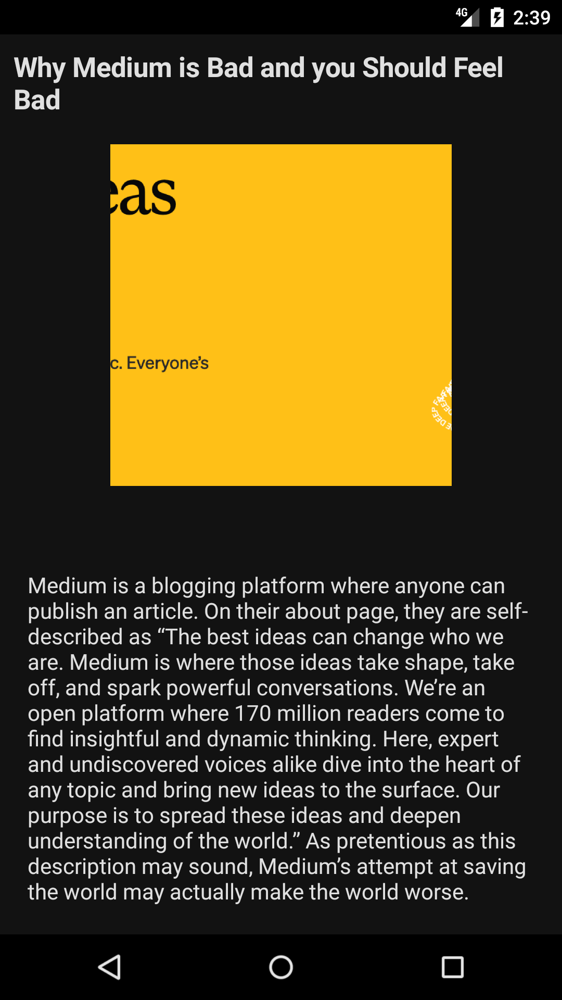
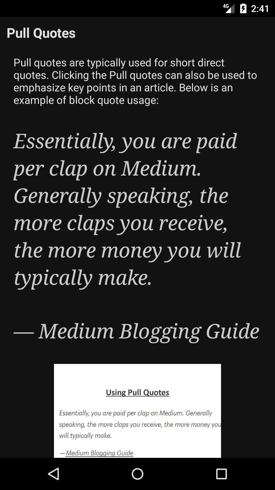

= Nedium

Read Medium articles freely without limits.

Share your medium article link and start reading.

link:https://github.com/cloneconf/Nedium/releases/download/v0.1/app-release.apk[Download APK]

[cols="1,1"]
|===
|
|
|===

== Notes

.Graphql schema

* Edit schema file:

`/schema.graphql`

* Generate introspection json and put in: (using e.g.: https://transform.tools/graphql-to-introspection-json):

`src/main/graphql/com/medium/schema.json`

* Put all the graphql requests in:

`src/main/graphql/com/medium`

